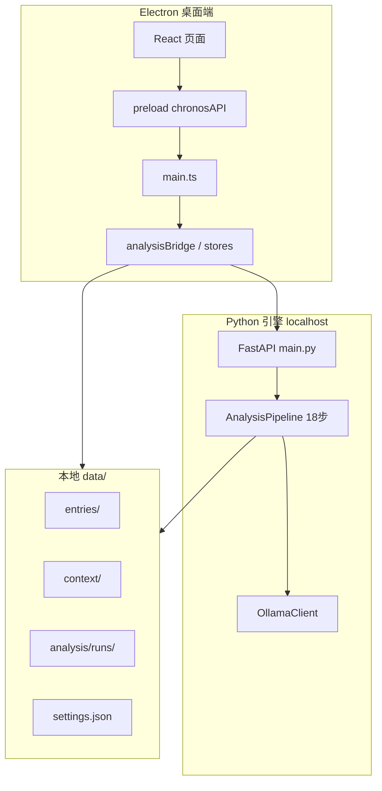

# Chronos 项目文档（唯一权威版）

> 版本：0.1.0 · 整理：2026-06-23  
> **本文档为 Chronos 唯一完整说明**：架构、功能、接口、数据模型、算法规则、质量差距、维护规范。改代码须同步更新本文档对应章节。

---
## 1. 项目概述

**Chronos** 是个人心理健康洞察桌面应用：从**纵向日记文本**出发，融合**多源语境**（天气、可穿戴、屏幕时间、位置等），自动识别情绪锚点、促进/损害因素与叙事结构，生成**有证据引用**的结构化报告。

| 维度 | 说明 |
|------|------|
| 形态 | Electron 桌面端 + 本地 Python 分析引擎 |
| 数据 | 全部 JSON 文件，目录 `data/` |
| 语义 | 本地 Ollama（可选）；不可用则启发式降级 |
| 网络 | 仅 Open-Meteo 天气（经纬度+日期）；日记不上传 |

### 1.1 非目标

- 非临床诊断工具，不做治疗建议
- 不插补缺失语境、不虚构日记未写内容
- 无云端账号、无多用户协作

---

## 2. 系统架构



| 层级 | 路径 | 职责 |
|------|------|------|
| 渲染进程 | `src/` | React UI、路由、类型 |
| 主进程 | `electron/` | IPC、文件、子进程管理 |
| 分析引擎 | `engine/` | FastAPI + pipeline + context 导入 |
| 数据 | `data/` | 日记、语境、分析产物、用户编辑 |

**进程关系**：Electron 启动 `PythonManager` 拉起 uvicorn（`engine/main.py`）；分析通过 HTTP SSE 流式返回进度。

---

## 3. 技术栈

### 3.1 前端 / 桌面

| 技术 | 版本 | 用途 |
|------|------|------|
| Electron | 33 | 桌面壳 |
| React | 18 | UI |
| TypeScript | 5.7 | 类型 |
| Vite | 6 | 构建 |
| React Router | 6 | Hash 路由 |

无 UI 组件库；样式为 `src/styles/app.css`（CSS 变量，当前为**柔和浅色护眼**主题）。

### 3.2 分析引擎（Python ≥3.11）

| 依赖 | 用途 |
|------|------|
| FastAPI + uvicorn | HTTP API |
| pydantic | 模型校验 |
| pandas / numpy / scipy | 统计 |
| statsmodels | OLS 控制变量 |
| jieba | 分词、启发式主题 |
| chinese-calendar | 节假日 |
| gpxpy | GPX 轨迹 |
| httpx | Ollama、Open-Meteo |

### 3.3 外部服务

| 服务 | 调用方 | 数据 |
|------|--------|------|
| Ollama `127.0.0.1:11434` | `llm/ollama_client.py` | 日记片段（用户自托管） |
| Open-Meteo Archive | `context/weather_client.py` | lat, lng, 日期, daily 气象字段 |

---

## 4. 仓库目录结构

```
Chronos/
├── electron/           # 主进程、IPC、Bridge、Store
├── src/                # React 前端
│   ├── pages/          # 8 个功能页
│   ├── components/     # 报告、叙事组件
│   ├── types/          # TS 类型（对齐 models.py）
│   └── styles/         # app.css
├── engine/
│   ├── main.py         # FastAPI 入口
│   ├── schemas/        # Pydantic 模型
│   ├── pipeline/       # 分析步骤（25 模块）
│   ├── context/        # 语境导入、对齐、天气
│   ├── llm/            # Ollama + prompts
│   ├── data/lexicons/  # 语言模式词表
│   └── utils/          # baseline 等
├── scripts/            # dev、分析 CLI
├── docs/               # 项目文档（本目录）
├── data/               # 运行时数据（gitignore 大部分）
└── release/            # electron-builder 产物
```

---

## 5. 数据存储

### 5.1 目录说明

| 路径 | 内容 | Git |
|------|------|-----|
| `data/entries/` | 当年日记 JSON | 忽略 |
| `data/settings.json` | 常驻城市、坐标、defaultRunId | 忽略 |
| `data/context/{weather,wearable,digital,location}/` | 按日语境 JSON | 忽略 |
| `data/analysis/runs/{runId}/` | 单次分析全量产物 | 忽略 |
| `data/story/edits/` | 叙事线用户标注 | 忽略 |
| `data/reframe/sessions/` | 重构对话会话 | 忽略 |

### 5.2 单次分析产物（`runId` 目录）

| 文件 | 步骤 | 说明 |
|------|------|------|
| `meta.json` | - | status, entryCount, phase, 时间戳 |
| `morphs.json` | extract | 段落形态 |
| `units.json` | extract | 信息单元 |
| `emotion.json` | emotion | 情绪序列 |
| `context.json` | align | 对齐后 DailyContext |
| `anchors.json` | anchors / chains | 锚点（chains 后更新） |
| `factors.json` | factors | promoting + damaging |
| `network.json` | network | 关系网络 |
| `interactions.json` | interaction | 交互效应 |
| `environment.json` | environment | 天气敏感 + 空间情绪 |
| `physio.json` | physio | 生理耦合 |
| `warnings.json` | warning | 预警模式 |
| `language.json` | language | 语言指标 |
| `themes.json` | themes | 主题轨 |
| `chains.json` | chains | 关联链 |
| `story.json` | story | 生命故事书 |
| `selves.json` | selves | 多元自我 |
| `reframe_candidates.json` | reframe | 重构候选 |
| `report.json` / `report.html` | report | 洞察报告 |

类型定义见 **§17 JSON Schema 与类型**。

### 5.3 设置项（`UserSettings`）

```json
{
  "residentCity": "洛阳",
  "latitude": 34.6197,
  "longitude": 112.454,
  "timezone": "Asia/Shanghai",
  "defaultRunId": "run_20260623_182051"
}
```

---

## 6. 功能清单

### 6.1 一期（日记文本）

| 功能 | 实现模块 | 状态 |
|------|---------|------|
| 日记导入（Echo/文件/目录） | `electron/importStore` | 已实现 |
| 形态五分类 + 信息单元抽取 | `morph_classifier` | 已实现（LLM 批量 + 启发式） |
| 六类锚点涌现 | `anchor_detector` | 已实现（含 contradiction） |
| 情绪评分 + 稳定性 | `emotion_analyzer` | 已实现 |
| 促进/损害/伪促进因素 | `factor_analyzer` | 已实现 |
| 关系网络 | `network_analyzer` | 已实现（称谓别名归一化） |
| 语言模式 + 隐喻 | `language_analyzer` | 已实现（自建词表非 LIWC） |
| 主题生命周期 | `theme_analyzer` | 已实现（LLM → NMF → LDA → jieba） |
| 洞察报告 | `report_builder` | 已实现 |

### 6.2 二期（多源语境）

| 功能 | 实现模块 | 状态 |
|------|---------|------|
| 常驻城市 + 天气拉取/测试 | `settingsStore`, `weather_client` | 已实现 |
| 时间节律（星期/节假日/节气） | `rhythm_tagger` | 已实现 |
| Apple Health / CSV / GPX / 手动地点 | `context/importers/*` | 已实现 |
| CSV 列映射 UI | `DataSourcesPage` | 已实现 |
| 语境对齐 | `align_engine` | 已实现 |
| 控制变量 OLS | `controlled_factors` | 已实现（样本门槛） |
| 交互效应 | `interaction_analyzer` | 已实现（6 条规则 + t 检验，Top6） |
| 天气/空间敏感性 | `weather_sensitivity`, `space_emotion` | 已实现 |
| 生理-心理耦合 | `physio_coupling` | 已实现 |
| 预警模式 | `warning_detector` | **已实现** — benchmark `warning` fixture，目标 R≥0.6 / P≥0.3 |

### 6.3 三期（叙事）

| 功能 | 实现模块 | 状态 |
|------|---------|------|
| 五类锚点关联链 | `chain_link_builder` | 已实现 |
| 生命故事书 + 用户标注 | `story_builder`, `narrativeStore` | 已实现 |
| 多元自我（星盘/河流/转换） | `selves_analyzer` | 已实现（≥8 内省 TF-IDF+KMeans；不足关键词） |
| 问题叙事识别 + 重构对话 | `problem_narrative_detector`, `reframe_dialogue` | 已实现 |
| 报告叙事脉络板块 | `report_builder` | 已实现 |

---

## 7. 分析流水线（18 步）

顺序定义：`engine/pipeline/runner.py` → `STEPS`。

| # | step | 模块 | 输出文件 |
|---|------|------|---------|
| 1 | extract | `morph_classifier.extract_all_morph_and_units` | morphs, units |
| 2 | emotion | `emotion_analyzer` | emotion |
| 3 | context | `context_ingest` | （写 context 缓存） |
| 4 | align | `align_engine` | context |
| 5 | anchors | `anchor_detector` | anchors |
| 6 | factors | `controlled_factors` | factors |
| 7 | network | `network_analyzer` | network |
| 8 | interaction | `interaction_analyzer` | interactions |
| 9 | environment | `weather_sensitivity`, `space_emotion` | environment |
| 10 | physio | `physio_coupling` | physio |
| 11 | warning | `warning_detector` | warnings |
| 12 | language | `language_analyzer` | language |
| 13 | themes | `theme_analyzer` | themes |
| 14 | chains | `chain_link_builder` | chains, anchors |
| 15 | story | `story_builder` | story |
| 16 | selves | `selves_analyzer` | selves |
| 17 | reframe | `problem_narrative_detector` | reframe_candidates |
| 18 | report | `report_builder` | report.json/html |

### 7.1 性能与 LLM 策略

| 项 | 当前值 |
|----|--------|
| 批量抽取 batch | 20 篇/批（`EXTRACT_BATCH_SIZE`） |
| 抽取快模型 | `CHRONOS_EXTRACT_MODEL` 默认 `gemma3:4b` |
| 情绪分块 | 30 篇/批 |
| 主题采样 | >60 篇时抽 60 篇 |
| Ollama 不可用 | 全流水线 `use_llm=False` |

CLI：`scripts/run_analysis.py` / `scripts/run-analysis.ps1`。

---

## 8. 前端页面

侧边栏三组导航（`src/App.tsx`）：

| 分组 | 路由 | 页面 | 职责 |
|------|------|------|------|
| 数据 | `/` | ImportPage | Echo 同步、文件导入 |
| 数据 | `/sources` | DataSourcesPage | 可选扩展语境导入（默认折叠；天气在设置页） |
| 数据 | `/settings` | SettingsPage | 城市、天气测试、天气覆盖率 |
| 分析 | `/analysis` | AnalysisPage | 引擎状态、启动分析、历史 run |
| 洞察 | `/report` | ReportPage | 分析总览、情绪折线、天气图表、各板块 Tab、锚点、导出 |
| 洞察 | `/story` | StoryPage | 叙事线、接受/拒绝/标注 |
| 洞察 | `/selves` | SelvesPage | 星盘、河流、声音画像 |
| 洞察 | `/reframe` | ReframePage | 候选列表、引导对话 |

**默认 run**：`settings.defaultRunId` + `resolveRunId()`（`src/utils/runSelection.ts`）。

---

## 9. 接口

### 9.1 Electron IPC（`window.chronosAPI`）

| 通道 | 说明 |
|------|------|
| `listEntries` / `getEntrySummary` | 日记列表与统计 |
| `syncFromEcho` / `importFromPath` / `importFromEcho` | 导入 |
| `getSettings` / `saveSettings` / `testWeather` | 设置 |
| `importContext` / `previewCsv` / `saveManualLocation` | 语境 |
| `getEngineHealth` | Python + Ollama |
| `startAnalysis` / `cancelAnalysis` | 分析 / 取消 |
| `listRuns` / `getDefaultRunId` / `getReport` | 分析结果 |
| `getStoryBook` / `saveStoryEdit` | 生命故事 |
| `getSelfVoiceMap` | 多元自我 |
| `listReframeCandidates` / `reframeStart` / `reframeMessage` / `reframeFinalize` | 重构 |
| `exportReportHtml` / `exportReportJson` / `saveExport` | 导出 |
| `getDataInventory` / `deleteAllUserData` / `deleteDiaryEntries` / `deleteAnalysisRun` | 数据统计 / 一键删除 / 删日记+可选脱敏 / 放弃未完成 run |
| `getFeedback` / `setFeedback` | 报告结论与锚点质量反馈 |
| `getFeedbackSummary` / `exportFeedbackJson` | 设置页反馈汇总与导出 |
| `runBenchmark` / `getLastBenchmarkSuite` | 全部 fixture 质量基准评估 |

完整签名：`src/vite-env.d.ts`、`electron/preload.ts`。

### 9.2 Python HTTP（`engine/main.py`）

| 方法 | 路径 | 说明 |
|------|------|------|
| GET | `/health` | python, ollama 状态 |
| POST | `/analyze` | SSE：`progress` / `complete` / `error` |
| POST | `/analyze/cancel` | 取消进行中的分析 |
| GET | `/benchmark/demo` | 运行 demo 标注集评估 |
| GET | `/benchmark/all` | 运行全部 fixture，写入 `data/benchmark/last_suite.json` |
| POST | `/reframe/start` | 创建会话 |
| POST | `/reframe/message` | 对话轮次 |
| POST | `/reframe/finalize` | 生成替代故事 |

---

## 10. 配置与环境变量

| 变量 | 默认 | 说明 |
|------|------|------|
| `CHRONOS_DATA_DIR` | `data` | 数据根目录 |
| `CHRONOS_EXTRACT_MODEL` | `gemma3:4b` | 大批量抽取模型 |
| `CHRONOS_FAST_MODEL` | 同 EXTRACT | emotion/themes 等 |
| `PYTHONUTF8` | - | Windows 建议 `1` |

Ollama 默认模型：`engine/llm/ollama_client.py` → `DEFAULT_MODEL`；UI 分析页默认 `gemma3:4b`。

---

## 11. 开发与构建

```powershell
cd F:\commercial\Chronos
pip install -e ./engine      # 或 npm run engine:install
npm install
.\start.ps1                  # 或 npm run dev
npm run build:dir            # 打包 win-unpacked
```

| 脚本 | 用途 |
|------|------|
| `scripts/dev.ps1` | Vite + Electron 开发 |
| `scripts/run-analysis.ps1` | 全量 CLI 分析 |
| `scripts/sync-data.ps1` | 数据同步辅助 |

---

## 12. 隐私与安全

- 日记与报告：**仅本地** `data/`
- 天气请求：仅 `latitude`, `longitude`, `start_date`, `end_date` 及 Open-Meteo daily 字段
- 证据链标注 `explicit`（原文可引用）vs `inferred`（系统推断）
- **已实现**：删除日记原文时可保留脱敏分析（`deleteDiaryEntries` + `anonymizeRuns.ts`）；一键删除全部见设置页

---

## 13. 质量现状与优化 backlog

> **本节用于差距分析**；算法阈值详见 **§18**。

### 13.1 算法与数据质量

| 优先级 | 问题 | 状态 |
|--------|------|------|
| 高 | 主题分析非正式主题模型 | **部分** — LLM → NMF → LDA → BERTopic（可选）→ jieba |
| ~~中~~ | ~~GPX 无聚类~~ | **已修复** — 主簇 centroid + placeType |
| ~~中~~ | ~~交互效应仅 2 条~~ | **已修复** — 6 规则 + Welch t 检验 |
| 中 | 自我声音为关键词分类 | **已修复** — TF-IDF + KMeans（≥8 条内省） |
| ~~低~~ | ~~个人基线不跨 run~~ | **已修复** — `data/baseline/emotion.json` |
| ~~高~~ | ~~无 contradiction 锚点~~ | **已修复** — 同主题 60 天内相反极性 |
| ~~高~~ | ~~人物名无归一化~~ | **已修复** — `utils/person_names.py` 别名表 |
| ~~中~~ | ~~结构锚点过于敏感~~ | **已修复** — 间隔≥3 天、7 天内去重 |
| ~~低~~ | ~~置信度无统一分级~~ | **已修复** — App 报告页 + HTML 导出高/中/低（≥0.7 / ≥0.45） |

### 13.2 工程与体验

| 优先级 | 问题 | 状态 |
|--------|------|------|
| ~~中~~ | ~~无分析取消/断点续跑~~ | **已修复** — 取消 + 步骤 checkpoint 续跑 |
| 低 | 无主题切换 | **已修复** — 浅色/深色/跟随系统 |
| 中 | 无单元/集成测试 | **部分** — `engine/tests/`（含 weather_insights、interpretation） |
| 低 | 无用户反馈收集 | **已修复** — 报告 👍👎 + 设置页汇总，`data/feedback/` |
| ~~高~~ | ~~导出 report.html 旧样式~~ | **已修复** — 与 App 浅色令牌一致 |

### 13.3 产品/合规

| 项 | 状态 |
|----|------|
| 临床免责声明 | **已移除** — 保留报告内「局限声明」 |
| 数据删除 API | **已实现** — `deleteAllUserData` / `deleteDiaryEntries`（可选脱敏）+ 设置页 |
| 离线完全可用 | 需 Ollama 才达最佳效果；可纯启发式 |
| 评估 benchmark | **部分** — demo + contradiction + intensity + **warning**（含 P/R 目标） |

### 13.4 已验证能力（参考 run）

以 `run_20260623_182051`（174 篇，洛阳天气）为例：

- 全流程约 15 分钟（批量抽取 + gemma3:4b）
- 103 锚点、372 关联链、5 自我声音、9 报告板块
- 重构候选可能为 0（取决于日记内容）

---

## 14. 报告结构（InsightReport）

### 14.1 报告页 UI（`ReportPage`）

- **分析总览**：`executiveSummary` 要点列表 + `EmotionTimelineChart` 情绪折线 + 锚点时间轴 + 天气对比条/散点图
- **数据覆盖**：仅展示 `entries` / `emotion` / `weather` 三项（相对日记+常驻城市天气场景）
- **板块 Tab**：见下表；因素结论含 `implication`「这意味着」；锚点类型中文化

顶层字段：`weatherInsights[]`、`executiveSummary[]`、`emotionSeries`、`dailyContexts`（图表与总览使用）。

### 14.2 sections

| section.id | 标题 | 条件 |
|------------|------|------|
| stability | 情绪稳定性 | 始终 |
| promoting | 促进因素 | 始终 |
| damaging | 损害因素与警示 | 始终 |
| relationships | 关系健康度 | 始终 |
| interactions | 因素交互效应 | 始终（无结果时占位说明） |
| language | 语言与思维模式变迁 | 始终 |
| themes | 主题演变 | 始终（附 intensity  sparkline） |
| environment | 天气与情绪 | 始终（白话洞察 + 图表） |
| warnings | 个人预警模式 | 始终 |
| narrative | 叙事脉络 | 三期 |

`dataCompleteness`（报告展示）：`entries` / `emotion` / `weather`。

---

## 17. JSON Schema 与类型

代码真源：`engine/schemas/models.py`、`src/types/analysis.ts`。

### 17.1 一期核心类型

| 类型 | 说明 |
|------|------|
| `DiaryEntry` | 日记条目（date, content, paragraphs[]） |
| `MorphResult` | 段落形态（narrative/introspective/sketch/list/mixed） |
| `InfoUnit` | 信息单元：event_package / thought_anchor / emotion_marker / rhythm_info |
| `AnchorCard` | 锚点卡（含三期 `chainLinks[]`） |
| `EmotionPoint` | date, score, valence, arousal, confidence |
| `FactorConclusion` | 因素结论（含 `controlledFor[]`） |
| `PersonNode` | 关系网络节点 |
| `LanguageMetric` | 语言模式指标 |
| `ThemeTrack` | 主题生命周期 |
| `InsightReport` | 完整洞察报告 |

### 17.2 二期扩展

**UserSettings**（`data/settings.json`）：`residentCity`, `latitude`, `longitude`, `timezone`, `defaultRunId`, `theme`（light/dark/system）

**DailyContext**（`data/context/` 按日）：`weather`, `rhythm`, `wearable`, `digital`, `location`, `missingFlags[]`

**分析产物**：`WeatherSensitivity`, `SpaceEmotionLink`, `PhysioCoupling`, `InteractionEffect`, `WarningPattern`

### 17.3 三期扩展

| 类型 | 存储 |
|------|------|
| `ChainLink` | runs/{runId}/chains.json |
| `LifeStoryBook`, `NarrativeLine`, `StoryNode` | story.json |
| `SelfVoiceMap` 及子类型 | selves.json |
| `ReframeCandidate` | reframe_candidates.json |
| `ReframeSession`, `ReframeMessage` | data/reframe/sessions/{id}.json |
| 用户叙事编辑 | data/story/edits/{runId}.json |

**InsightReport 三期字段**：`chainLinks[]`, `lifeStory`, `selfVoiceMap`, `reframeCandidates[]`

### 17.4 关键嵌套字段

```
EventPackage: summary, participants[], location, activityType, emotionArc
ThoughtAnchor: coreConcern, cognitivePattern, selfVoice, metaphor
EmotionMarker: label, intensity
Evidence: date, text, charOffset?, charLength?, source (explicit|inferred)
```

---

## 18. 分析算法与阈值规格

| 状态 | 含义 |
|------|------|
| **已实现** | 代码中有明确规则/阈值 |
| **部分实现** | 启发式或简化版 |
| **待定义** | 未实现或仅占位 |

代码真源：`engine/schemas/models.py`、`engine/pipeline/*.py`。

### 18.1 一期 — 形态与抽取

**段落分割**：`\n\n` 空行；无空行则整篇单段。混合型每段独立分类。

| 形态 | 启发式兜底 |
|------|-----------|
| list | ≥3 行、行宽<30、含列表符 |
| sketch | <80 字 |
| introspective | 内省词>叙事词且≥2 |
| narrative | 叙事词≥2 |
| mixed | 默认 |

**LLM**：Ollama 不可用则全启发式；≥15 篇批量 20 篇/批（`CHRONOS_EXTRACT_MODEL`）；单批失败回退启发式。

**信息单元字段**：EventPackage / ThoughtAnchor / EmotionMarker / RhythmInfo（见 §17.4）。叙事线 `emotionArc` 为数值序列，故事页以 sparkline 展示。

**结构锚点**：主导 morph 变化；日期间隔≥3 天；7 天内不重复触发。

### 18.2 一期 — 锚点涌现

| 类型 | 触发条件 | 置信度 |
|------|---------|--------|
| intensity | z-score w=5, \|z\|≥1.8 | 0.5+0.15×\|z\| |
| frequency | 实体≥3；近月≥前月×2 且≥3 | 0.55 |
| structure | 主导 morph 变；间隔≥3天 | 0.5–0.55 |
| narrative | 摘要前30字重复≥2，跨度≥7天 | 0.55 |
| silence | 实体≥4；沉默>中位×3 且>14天 | 0.5 |
| contradiction | 同主题 60 天内相反极性（词表/情绪/valence） | 0.5+ |

基线：rolling_zscore；无跨 run 持久化。

### 18.3 一期 — 情绪 / 因素 / 关系 / 语言 / 主题

- **情绪**：LLM 1-10 分，30篇/批；恢复时间低谷 median−1.5
- **因素**：前7/后7/后30天；Δ±0.3；Cohen's d；Top10
- **关系**：≥2次；tone ±0.1；var 0.3；Top20；**称谓别名归一化**（`person_names.py`）
- **语言**：lexicons 四文件；±15% 趋势；隐喻 LLM 近20篇
- **主题**：LLM≤8；fallback **NMF**（≥10 篇）→ **LDA** → jieba Top8

### 18.4 二期 — 语境与控制

- **天气**：Open-Meteo 仅坐标+日期；Pearson r，≥8配对
- **Apple Health**：steps / sleepHours / restingHr
- **CSV 映射**：UI 模态框，中英文列名猜测
- **GPX**：轨迹点聚类 → 主簇 centroid；placeType routine/multi_stop/transit
- **空间**：valence ±0.15 → restorative/stressful
- **OLS**：factor + temp/precip/weekday/sleep；≥15日且天气≥10天
- **交互**：6 条规则 + Welch t-test（p<0.1）；Top6
- **physio**：lag 0-7，\|r\|≥0.25
- **预警**：z<-1.5，前3-14天信号，Top5组合

### 18.5 三期 — 叙事

- **关联链**：theme/person/causal/contrast/evolution（阈值见 chain_link_builder）
- **故事**：链选线≤10；留白；edits 存 story/edits/
- **自我**：TF-IDF+KMeans 聚类（≥8 内省单元）映射四类 voice；不足时关键词
- **重构**：5 regex；对话禁「你应该」类表述

### 18.6 全局与已知差距

| 场景 | 行为 |
|------|------|
| Ollama 不可用 | 全启发式 |
| 0 / <3 / <5 篇 | 拒绝 / 降级 / 跳过因素 |

1. benchmark 可继续扩展真实日记标注集  

分析 checkpoint：`runs/{runId}/checkpoint.json`；取消后 status=`paused`，分析页可「放弃并删除」清理半成品。  
用户反馈：`data/feedback/{runId}.json`；设置页汇总。  
Benchmark 结果：`data/benchmark/last_suite.json`；预警目标见 `engine/benchmark/targets.py`（R≥0.6, P≥0.3）。

---

## 19. 文档维护规范

**唯一文档即本文档（`docs/project.md`）**。代码变更后须更新对应章节。

| 变更类型 | 更新章节 |
|---------|---------|
| pipeline / 阈值 / 算法 | §7、§18 |
| 类型 / data 目录 | §5、§17 |
| IPC / API / 页面 | §8、§9 |
| 配置 / 脚本 | §10、§11 |
| 新差距或已修复差距 | §13、§18.4 |
| UI 主题 / 导航 | §8 |

**提交前检查**：文档描述与代码一致；§20 追加修订记录。

---

## 20. 文档修订记录

| 日期 | 摘要 |
|------|------|
| 2026-06-23 | backlog 五项：warning benchmark（P/R 目标）、删日记脱敏、BERTopic fallback、pipeline 冒烟测试、取消后放弃删除 run |
| 2026-06-23 | 报告可读性重构：总览+情绪/天气图表、白话天气洞察、语境 UI 裁剪 |
| 2026-06-23 | 故事页情绪弧线、反馈 JSON 导出、intensity benchmark、单元测试扩展 |
| 2026-06-23 | NMF 主题 fallback、App 置信度分级、反馈汇总 UI、contradiction benchmark fixture |
| 2026-06-23 | 报告反馈 UI、benchmark 评估框架、启发式人物提及抽取 |
| 2026-06-23 | 断点续跑 checkpoint、自我声音聚类、深色主题 |
| 2026-06-23 | 分析取消、GPX 聚类、交互扩展+t检验、LDA 主题 fallback、情绪基线持久化 |
| 2026-06-23 | 差距修复：contradiction 锚点、人物归一化、结构锚点阈值、HTML 导出样式、免责声明页、数据删除 API、锚点单元测试 |
| 2026-06-23 | 初版：多文档合并为唯一权威版 project.md |
